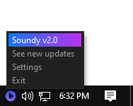
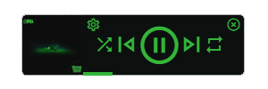

# Soundy
A universal minimal media controller for Windows

 
 

## Simple
Soundy is designed to be simple but functional, implementing only the functions you need but doing it well. Controls are: play/pause, skip, shuffle, repeat, time scrubber.

 

## Universal
Hooking into [Window's Runtime API](https://docs.microsoft.com/en-us/uwp/api/windows.media.control.globalsystemmediatransportcontrolssession), Soundy is compatible with most desktop media players. Essentially, if your app implements [this media popup](https://i.stack.imgur.com/Wr78Q.png) then it will be supported.

 

## Stylish
Soundy features a clean and minimal interface that adapts its colors based on the current media's thumbnail, managing to always look stunning.

 

## Streamers rejoice
By default Soundy stays always on top of other windows, giving you (and your potential audience) all the needed info with a quick glance.

 

## Bloat free
Soundy only interacts with the Windows internal API, meaning that you don't need any form of premium account or login.

 
 

## Always at arm's reach
By default Soundy will hide after a few seconds without detecting media, but fear not, as its tray icon is always there for you.

 

## Spread the love
If you're a regular Discord user you might be interested in Soundy's Discord Rich Presence integration, which sports similar behavior to the main interface.

 
 

## Modular
You can change your Soundy configuration very easily from the dedicated settings window, allowing you to toggle features such as its interface staying on top of other windows, hiding when no media is detected, toggling the Discord RPC integration and whether Soundy will start with Windows.

 
 

## Convinced? Here's how to get Soundy!
Since this program doesn't even connect to the internet there is no auto-updating, you will need to do that yourself. Soundy's tray icon has a link to the releases page though, so just be sure to check there every so often.

 - Head over to the [Releases](https://github.com/Willy-JL/soundy/releases) section
 - Grab the latest binaries (`SoundyVx.x.zip`)
 - Extract the zip somewhere that you won't delete / move
 - Run `Soundy.exe`

When an update is released you'll just have to download the new binaries and replace your previous installation files with the new ones.

 

## Credits:
[This amazing answer](https://stackoverflow.com/a/66037406) on Stack Overflow

 

## Gallery

